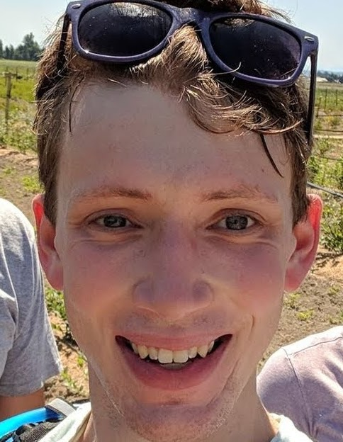

**Welcome to The 1st Workshop on Efficiency, Security, and Generalization of Multimedia Foundation Models at ACM Multimedia 2024!**

---

## **Call for Papers** {#call}

**Submission Deadline: July 19, 2024**

The rapid progress in foundation models has enhanced the capabilities of multimedia models across a broad spectrum of tasks. Despite their exceptional performance, deploying these models in practical settings raises several concerns, particularly regarding efficiency, security, and generalization. As the utility of foundation models in multimedia topics becomes increasingly evident, addressing these issues is crucial. This workshop focuses on these critical aspects in foundation models, where the scope of the foundation model encompasses a wide range of domains such as vision, language, speech etc., with an emphasis on multimedia tasks and multi-modality methods. 

Therefore, we solicit original research papers in (but not limited to) the following topics:

**Efficiency**
- Efficient network design in foundation models
- Training efficiency of foundation models
- Inference efficiency of foundation models

**Security**
- Adversarial robustness of foundation models
- Privacy and memorization in foundation models
- Trustworthiness and alignment of foundation models

**Generalization**
- Generalization across tasks
- Generalization across data
- Generalization across modalities

The submission guideline follows the main conference site of [ACM Multimedia 2024](https://2024.acmmm.org/), including the formatting guideline and submission policies. 
The review process for this workshop will be "double-blinded”.
Submissions should be of up to 4-page length in [ACM-MM format](https://2024.acmmm.org/files/ACM-MM24-paper-templates.zip), plus up to 1 additional page for the references.

All papers will be peer-reviewed by at least three experts in the field, regarding the relevance to the workshop, scientific novelty, and technical quality. 
Accepted submissions will be presented via oral or poster sessions. 
The accepted workshop papers will be published in the ACM Digital Library.

Submit your manuscripts through [OpenReview](https://openreview.net/group?id=acmmm.org/ACMMM/2024/Workshop/ESGMFM).

---
## **Important Dates** {#dates}

| Submission Open | **May 11, 2024** |
| Submission Deadline | **July 19, 2024** |
| Decision Notification | **August 5, 2024** |
| Camera-Ready Deadline | **August 19, 2024** |
| Workshop Date | **TBD, Half-Day Between Oct 28 - Nov 1, 2024** |

---

## **Schedule** {#schedule}

The following schedule is tentative and will be confirmed closer to the workshop:

|   **Time**  |         **Topic**        |                             **Speakers**                            |
|------------:|:-------------------------|:-----------------------------------------------------------------------------------|
| 08:30 | *Start*                                |                                   |
| 08:30 | Opening Remarks                        | TBD                               |
| 08:40 | Invited Talk 1                         | TBD                               |
| 09:10 | Invited Talk 2                         | TBD                               |
| 09:40 | Oral Paper Presentation 1              | TBD                               |
| 09:50 | Oral Paper Presentation 2              | TBD                               |
| 10:00 | *Coffee Break*                         |                                   |
| 10:10 | Invited Talk 3                         | TBD                               |
| 10:40 | Invited Talk 4                         | TBD                               |
| 11:10 | Oral Paper Presentation 3              | TBD                               |
| 11:20 | Oral Paper Presentation 4              | TBD                               |
| 11:30 | *Poster Session*                       |                                   |
| 11:50 | Closing and Awards                     | TBD                               |
| 12:00 | *End*                                  |                                   |

---

## **Invited Speakers** {#speakers}

Coming soon

<!-- 

    <figure>
        
        <b> <a href="https://sites.google.com/cs.washington.edu/william-agnew/home">Sara Beery (She/Her)</a>
         Assistant Professor MIT</b>
    </figure>
    <figure>
        
        <b> <a href="https://sites.google.com/cs.washington.edu/william-agnew/home">William Agnew</a>
         CBI Postdoc Fellow CMU</b>
    </figure>

<a href="https://beerys.github.io/"><b>Dr. Sara Beery</b></a>
is the Homer A. Burnell Career Development Professor in the MIT Faculty of Artificial Intelligence and Decision-Making. She was previously a visiting researcher at Google, working on large-scale urban forest monitoring as part of the Auto Arborist project. She received her PhD in Computing and Mathematical Sciences at Caltech in 2022, where she was advised by Pietro Perona and awarded the Amori Doctoral Prize for her thesis. Her research focuses on building computer vision methods that enable global-scale environmental and biodiversity monitoring across data modalities, tackling real-world challenges including geospatial and temporal domain shift, learning from imperfect data, fine-grained categories, and long-tailed distributions. She partners with industry, nongovernmental organizations, and government agencies to deploy her methods in the wild worldwide. She works toward increasing the diversity and accessibility of academic research in artificial intelligence through interdisciplinary capacity building and education, and has founded the AI for Conservation slack community, serves as the Biodiversity Community Lead for Climate Change AI, and founded and directs the Summer Workshop on Computer Vision Methods for Ecology.

 -->

---

## **Organizers** {#organizers}

<figure>
    
    <b> <a href="https://daochang.site/">Daochang Liu</a>
     Postdoc The University of Sydney</b>
</figure>

<figure>
    
    <b> <a href="https://www.cs.cityu.edu.hk/~minjdong/">Minjing Dong</a>
     Assistant Professor City University of Hong Kong</b>
</figure>

<figure>
    
    <b> <a href="https://research.monash.edu/en/persons/yasmeen-george">Yasmeen George</a>
     Lecturer Monash University</b>
</figure>

<figure>
    
    <b> <a href="http://changxu.xyz/">Chang Xu</a>
     Associate Professor The University of Sydney</b>
</figure>

---
## **Contact** {#contact}

Contact the organizers at [mm2024-esgmfm@googlegroups.com](mailto:mm2024-esgmfm@googlegroups.com)

<!-- ## Program Committee
## Sponsors -->
