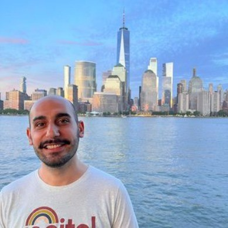
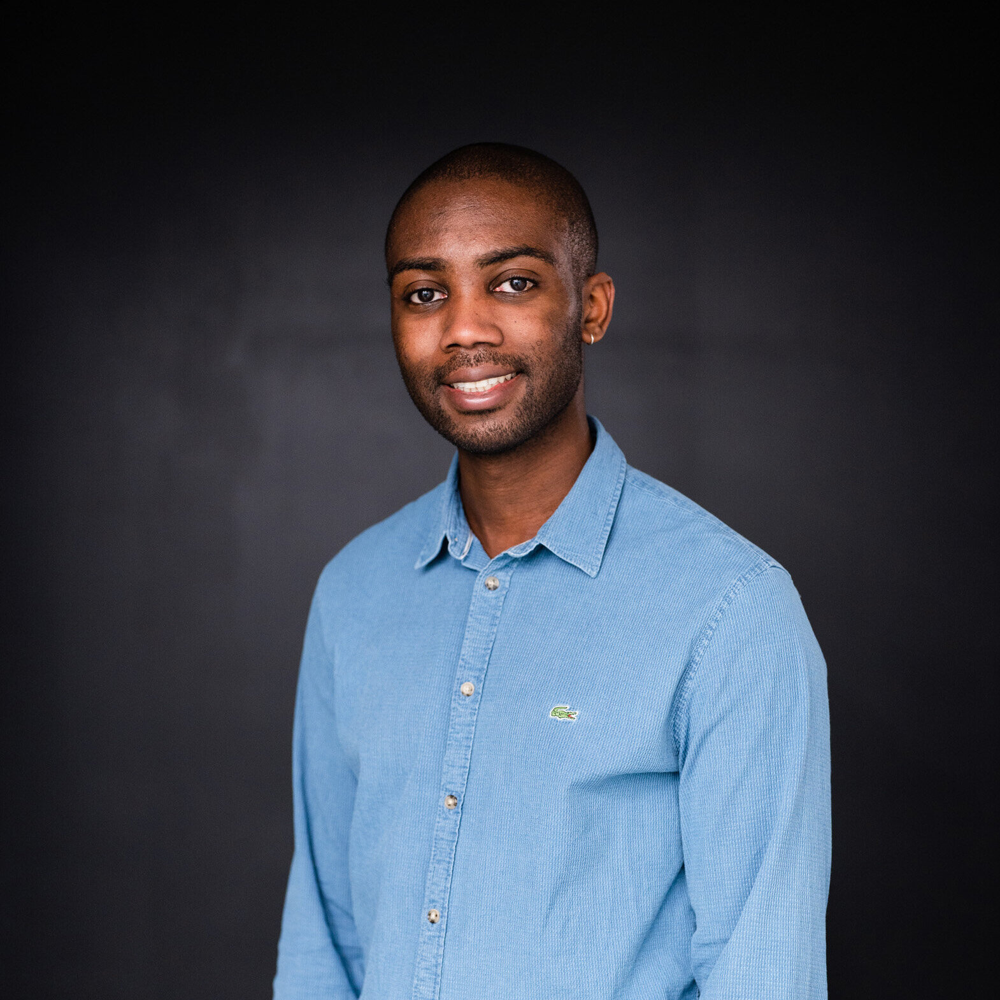
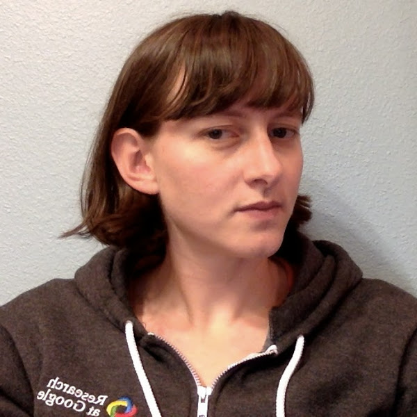
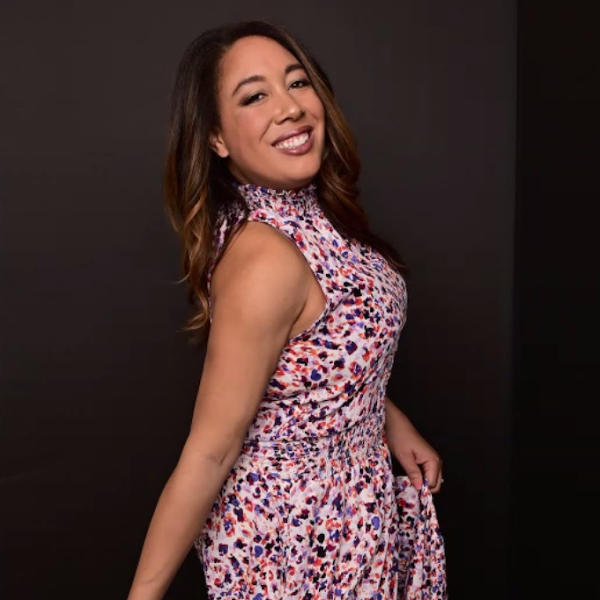
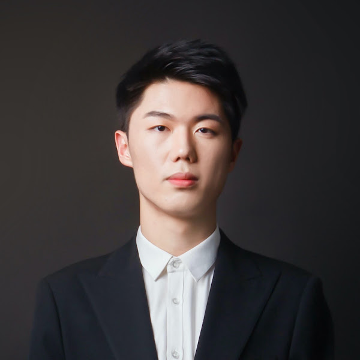
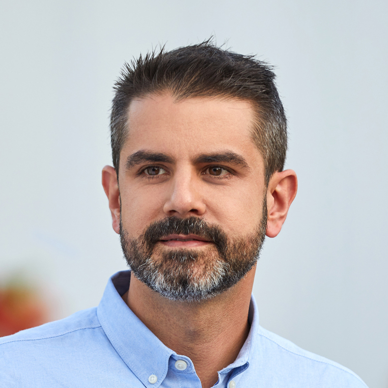
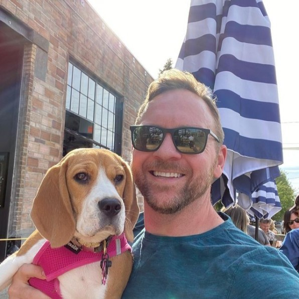

Welcome to our **Workshop on Responsible Data**!

The development of large-scale datasets has been essential to the progress of machine learning and artificial intelligence. However, many of these datasets are not inclusive or diverse - particularly computer vision datasets, which can lead to biased models and algorithms. This workshop will bring together practitioners and researchers to discuss the challenges and opportunities of building more responsible datasets.

The workshop will cover a range of topics, including:

+ Moving beyond pragmatism and implementation of context and consent-driven procedures in dataset development
+ What are the main themes when it comes to responsible datasets? Are there specific benchmarks currently utilized?
+ Challenges, risks and benefits of collecting gender, race, skin tone, physical attributes, accessibility data, and other person attributes.
+ What are the best practices when training individuals for data collection and annotators? To what extent does diversity matter when it comes to data collection and annotators? How the organizational structures of these businesses and the ecosystem of stakeholders contribute to the responsible dimension of the datasets?
+ What are the new considerations in a world of pretrained models and synthetic data?
+ How should we build responsible datasets for generative AI models and applications?
+ How do we quantitatively measure how responsible a dataset is?
+ What does Transparency translate to in the context of dataset development?
+ How do notions of Data Privacy like those articulated in proposals such as the Blueprint for an Bill of Rights translate to building towards responsible datasets?
+ How do we build a framework for Dataset Accountability?
+ How should we best engage the open source community when building, updating, and maintaining datasets?
+ State of Affairs: a summary of progress to date - how responsible datasets have evolved. What best practices can be leveraged more broadly?

Post workshop, we plan to write a white paper summarizing the round table discussions and opinions from experts in the field (with necessary permissions). We will also follow through with making a community space on discord (or similar platform) to continue the community building and collaboration post-workshop.

---
## **Call for Papers** {#call}

Authors are invited to submit relevent research (including work in progress, novel perspectives, etc.) as extended abstracts for the poster session and workshop discussion. Please see relevent topics above. Accepted abstracts will be presented at the poster session, and will not be included in the printed proceedings of the workshop.

The extended abstract can be at most 4 pages long in [CVPR format](https://github.com/cvpr-org/author-kit/releases), not including references. Authors may supply supplementary material, however, reviewers will not be required to read this material. Reviews will be double blind. The submission deadline is March 31, 2024.

Submit your extended abstracts through [OpenReview](https://openreview.net/group?id=thecvf.com/CVPR/2024/Workshop/Responsible_Data).

---
## **Important Dates** {#dates}
Submission Deadline: March 31, 2024

---

## **Schedule** {#schedule}
> TBA!

---

## **Keynote Speakers** {#speakers}

<figure>
    
    <b> <a href="https://sites.google.com/cs.washington.edu/william-agnew/home">William Agnew</a>
     CBI Postdoc Fellow CMU</b>
</figure>

<figure>
    
    <b> <a href="https://sites.google.com/cs.washington.edu/william-agnew/home">Sara Beery</a>
     Assistant Professor MIT</b>
</figure>

---
## **Panelists** {#panelists}

<figure>
    
    <b> <a href="https://www.linkedin.com/in/naticatalan/">Nati Catalan</a>
     Co-Founder Tasq.ai</b>
</figure>

<figure>
    
    <b> <a href="https://www.linkedin.com/in/sven-cattell-5748a311/">Sven Cattell</a>
     Founder of AI Village nbhd.ai</b>
</figure>

---

## **Organizers** {#organizers}

<figure>
    
    <b> <a href="https://candiceschumann.com/">Candice Schumann (They/She)</a>
     Research Engineer Google Research</b>
</figure>

<figure>
    
    <b> <a href="https://hazirbas.com/">Caner Hazirbas (He/Him)</a>
     Research Scientist Meta AI</b>
</figure>

<figure>
    
    <b> <a href="https://www.cs.princeton.edu/~olgarus/">Olga Russakovsky</a>
     Associate Professor, CS    Princeton</b>
</figure>

<figure>
    
    <b> <a href="https://www.cs.princeton.edu/~vr23/">Vikram V. Ramaswamy (He/They)</a>
     Associate Professor, CS    Princeton</b>
</figure>

<figure>
    
    <b> <a href="https://ai.sony/people/Jerone-Andrews/">Jerone Andrews</a>
     Research Scientist Sony AI</b>
</figure>

<figure>
    
    <b> <a href="https://ai.sony/people/Alice-Xiang/">Alice Xiang</a>
     Global Head of AI Ethics Sony AI</b>
</figure>

<figure>
    
    <b> <a href="https://www.linkedin.com/in/susanna-ricco/">Susanna Ricco (She/Her)</a>
     Research Engineer Google Research</b>
</figure>

<figure>
    
    <b> <a href="https://www.linkedin.com/in/courtney-heldreth-phd-3962b329/">Courtney Heldreth (She/Her)</a>
     UX Researcher Google Research</b>
</figure>

<figure>
    
    <b> <a href="">Biao Wang (He/Him)</a>
     Associate Product Manager Google Research</b>
</figure>

<figure>
    
    <b> <a href="https://cristiancanton.github.io/">Cristian Canton Ferrer (He/Him)</a>
     Head of GenAI Trust & Safety Meta AI</b>
</figure>

<figure>
    
    <b> <a href="https://www.linkedin.com/in/jessholbrook/">Jess Holbrook (He/Him)</a>
     Director and Principal Researcher, GenAI Meta AI</b>
</figure>

---
## **Contact** {#contact}
Contact the organizers at **[responsibledata@googlegroups.com](mailto:responsibledata@googlegroups.com)**

---
