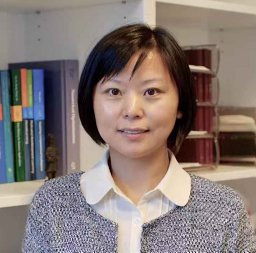

**Welcome to The Workshop on Sustainable AI for the Future Web at The Web Conference 2025!**

---

## **Call for Papers** {#call}

Web applications such as social media, e-commerce platforms, and search engines generate vast and diverse datasets that fuel AI advancements, enabling models to learn from real-world, dynamic information. Meanwhile, AI models are increasingly deployed within these web applications. Tools like ChatGPT, DALL·E, and sophisticated recommendation systems have seamlessly integrated into web-based services, delivering highly personalized user experiences, optimizing decision-making processes, and greatly enhancing productivity in areas like customer support, content creation, and data analysis. However, as AI and the web become more deeply intertwined, they also introduce significant challenges in building sustainable AI for the web.

This workshop will explore essential topics at the intersection of AI, sustainability, and the web, focusing on creating AI systems that are robust, energy-efficient, and ethically responsible within web applications. As AI models become increasingly integrated into platforms like social media, e-commerce, and search engines, their reliance on vast amounts of web data raises concerns around data quality, fairness, and computational resource demands. Key topics of discussion include, but are not limited to:

- **Sustainable AI Model Development:** Methods to reduce the carbon footprint and computational demands of training and deploying AI models on the web.

- **Data Integrity and Filtering Mechanism:** Strategies to handle the proliferation of low-quality and AI-generated content that risks polluting the web and undermining data quality.

- **Security, Robustness, and Fairness:** Techniques to improve the resilience of AI systems trained on noisy, diverse web data, ensuring they operate securely and equitably across varied user demographics. 

<!-- 
**Fast Track for WWW-25 Accepted Paper Submission Deadline: January 26, 2025, AoE**

**Submit Platform: [Openreview](https://openreview.net/group?id=ACM.org/TheWebConf/2025/Workshop/WSAI)**

We welcome submissions of papers ranging from 4 to 8 pages as main content, with up to 2 additional pages containing references and an optional appendix. All submissions must be in PDF format and formatted according to the new [ACM format](https://www.acm.org/publications/proceedings-template) published in ACM guidelines (e.g., using the ACM LaTeX template on [Overleaf](https://www.overleaf.com/latex/templates/association-for-computing-machinery-acm-sig-proceedings-template/bmvfhcdnxfty)) and selecting the “sigconf” sample. Following the WWW’25 conference submission policy, reviews are double-blind, and author names and affiliations should NOT be listed. Submitted works will be assessed based on their novelty, technical quality, potential impact, and clarity of writing (and should be in English). For papers that primarily rely on empirical evaluations, the experimental settings and results should be clearly presented and repeatable. We encourage authors to make data and code available publicly when possible.

Accepted papers will be posted on this workshop website. Papers accepted by a workshop can be included in the Companion Proceedings of the Web Conference 2025, subject to meeting the camera-ready timeline. The authors can also choose not to have their accepted papers appear in the WWW’25 proceedings. This allows authors to submit works that are concurrently under review elsewhere or published. Please send us an email in advance if you would like to include the accepted paper in the official proceeding.
-->

## **Important Dates** {#dates}

| Submission Open | **December 5, 2024** |
| Submission Deadline | **January 1, 2025 (AoE)** |
| WWW-25 Fast-Track Submission Deadline | **January 26, 2025 (AoE)** |
| Decision Notification | **January 27, 2025 (AoE)** |
| Camera-Ready Deadline | **Februray 7, 2025 (AoE)** |
| Workshop Date | **April 28 AM, 2025** |

---

## **Accepted Papers**

- **GPT4Image: Large Pre-trained Models Help Vision Models Learn Better on Perception Task**
  
  Ning Ding (Peking University), Yehui Tang (Huawei), Zhongqian Fu (Huawei), Chao Xu (Peking University), Kai Han (Huawei), Yunhe Wang (Huawei)

- **HSF: Defending against Jailbreak Attacks with Hidden State Filtering**

  Cheng Qian (Beihang University), Hainan Zhang (Beihang University), Lei Sha (Beihang University)

- **KG-UQ: Knowledge Graph-Based Uncertainty Quantification for Long Text in Large Language Models**

  Yingqing Yuan (University of Sydney), Linwei Tao (University of Sydney), Haohui Lu (University of Sydney), Matloob Khushi (University of Suffolk), Imran Razzak (Mohamed bin Zayed University of Artificial Intelligence), Mark Dras (Macquarie University), Jian Yang (Macquarie University), Usman Naseem (Macquarie University)

- **Integrating Edge Computing-Based Ethical Decision-Making Framework for AI**

  Jimin Ryu (Sookmyung Women's University), Hyeyoung Kim (Sookmyung Women's University), Yong Ik Yoon (Sookmyung Women's University)

- **OpenCarbonEval: How much $CO_2$ will your large model exhale during training?**

  Zhaojian Yu (Tsinghua University), Yinghao Wu (Tsinghua University), Zhuotao Deng (Tsinghua University), Xinchun Yu (Tsinghua University), Yansong Tang (Tsinghua University), Xiao-Ping Zhang (Tsinghua University)

- **Your Diffusion Classifier is Naturally a Robust Classifier**

  Yanxiang Ma (University of Sydney), Zixuan Huang (Beijing University of Posts and Telecommunications), Shan You (SenseTime Research)

## **Schedule** {#schedule}

| 8:55-9:00 | Start | Opening Remarks |
| 9:00 - 9:30 | Invited Talk 1 | [Dr. Jerone Andrews](https://ai.sony/people/Jerone-Andrews/), Sony AI, TBD |
| 9:30 - 10:00 | Invited Talk 2 | TBD |
| 10:00 - 10:30 | Invited Talk 3 | TBD |
| 10:30 - 11:00 | Morning tea |
| 11:00 - 11:30 | Invited Talk 4 | [Dr. Tomasz Bednarz](http://tomaszbednarz.com), NVIDIA, "_Foundation Models and Microservices for Advancing Generative AI Research Running Efficiently on GPUs Anywhere_" |
| 11:30 - 11:45 | Paper presentation 1 | Yingqing Yuan, USYD, "_KG-UQ: Knowledge Graph-Based Uncertainty Quantification for Long Text in Large Language Models_" |
| 11:45 - 12:00 | Paper presentation 2 | Ning Ding, PKU, "_GPT4Image: Large Pre-trained Models Help Vision Models Learn Better on Perception Task_" |
| 12:00 - 12:15 | Paper presentation 3 | Cheng Qian, BUAA, "_HSF: Defending against Jailbreak Attacks with Hidden State Filtering_" |
| 12:15 - 12:30 | Special session of AU Environmental Open Data Challenge | Xiaoyin Zhang, USYD, "_Solar First: A Data-Driven Roadmap for Regional Clean Energy Deployment_" |
| 12:30 | Closing |

**Location: Room C4.10, ICC Sydney: International Convention & Exhibition Centre**

---

<!-- ---

## **Program Committee** {#Committee}

Coming soon -->

---

## **Organizers** {#organizers}

<figure>
    
    <b> <a href="http://changxu.xyz/">Chang Xu</a>
     The University of Sydney</b>
</figure>

<figure>
    
    <b> <a href="https://yunke-wang.github.io">Yunke Wang</a>
     The University of Sydney</b>
</figure>

<figure>
    
    <b> <a href="https://ggjy.github.io">Jianyuan Guo</a>
     The University of Sydney</b>
</figure>

<figure>
    
    <b> <a href="https://daochang.site/">Daochang Liu</a>
     The University of Western Australia</b>
</figure>

<figure>
    
    <b> <a href="https://www.cs.cityu.edu.hk/~minjdong/">Minjing Dong</a>
     City University of Hong Kong</b>
</figure>

<figure>
    
    <b> <a href="https://research.monash.edu/en/persons/yasmeen-george">Yasmeen George</a>
     Monash University</b>
</figure>

<figure>
    
    <b> <a href="https://scholars.uow.edu.au/johan-barthelemy">Johan Barthélemy</a>
     NVIDIA</b>
</figure>

<figure>
    
    <b> <a href="https://sites.google.com/view/yanliu-ai/home">Yan Liu</a>
     University of Southern California</b>
</figure>

<figure>
    
    <b> <a href="https://profiles.uts.edu.au/Ling.Chen">Ling Chen</a>
     University of Technology Sydney</b>
</figure>

---
## **Contact** {#contact}

Contact the organizers at [workshopsai25@gmail.com](workshopsai24@gmail.com).

<!-- ## Program Committee
## Sponsors -->

